# Laboratório 02

## 1 - Objetivos

O objetivo desta aula é iniciar o desenvolvimento de um firmware para piscar o
LED integrado da placa de desenvolvimento **STM32F411 Blackpill**. O firmware
será desenvolvido **do zero**, ou seja, não será utilizada nenhuma ferramenta
de geração de código automatizada como o **STM32CubeIDE**, código ou drivers
de terceiros.

Neste laboratório serão abordados os seguintes temas:

* breve discussão sobre o processo de compilação;
* criação do arquivo de partida para microcontroladores Cortex-M;
* automação do processo de compilação utilizando o utilitário **make**.

Tempo estimado: 100 minutos

## 2 - Pré-requisitos

* Windows Subsystem for Linux 2;
* GCC - GNU C Compiler;
* GCC ARM Toolchain;
* OpenOCD - Open On Chip Debugger;
* Sistema de controle de versões Git, e;
* Microsoft Visual Studio Code.

## 3 - Referências

[1] [STM32F411xC Datasheet](https://www.st.com/resource/en/datasheet/stm32f411ce.pdf)

[2] [RM0383 Reference Manual](https://www.st.com/resource/en/reference_manual/rm0383-stm32f411xce-advanced-armbased-32bit-mcus-stmicroelectronics.pdf)

[3] [Using the GNU Compiler Collection (GCC)](https://gcc.gnu.org/onlinedocs/gcc/index.html)

[4] [GNU Make](https://www.gnu.org/software/make/manual/html_node/index.html)

## 4 - Criar novo projeto

Crie uma nova pasta para armazenar os arquivos deste projeto.

```console
foo@bar$ cd
foo@bar$ cd semb1-workspace
foo@bar:$ mkdir lab-02
foo@bar:$ cd lab-02
```

Inicialmente vamos criar um programa bastante simples e que, a priori, não faz
nada. Crie um novo arquivo **main.c** e digite as seguintes linhas de código.

Arquivo: **main.c**
```c
#include <stdlib.h>

int main(int argc, char *argv[])
{
  while(1){};

  /* Nao deveria chegar aqui */

  return EXIT_SUCCESS;
}
```

Visto que desejamos executar este programa em uma arquitetura diferente da 
máquina que estamos utilizando vamos compilar este programa utilizando o
compilador fornecido com o **GNU Arm Embedded Toolchain**, o programa
**arm-none-eabi-gcc**.

O comportamento padrão do compilador é compilar o programa gerando arquivos
objetos realocáveis, extensão **.o**, e em seguida agrupar estes arquicos em um
processo denominado **linking**, ou **linkedição**, gerando um único arquivo
**executável**. A figura abaixo mostra o processo completo, que pode envolver
bibliotecas externas e diversos arquivos fontes.

<p align="center">
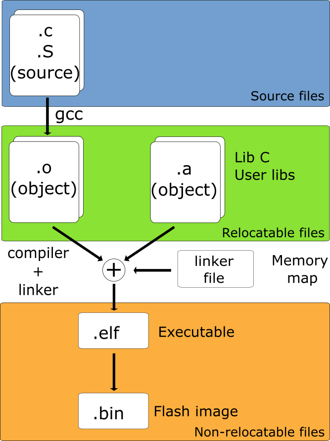
</p>

Como veremos posteriormente os microcontroladores da linha **ARM Cortex-M**
necessitam que o programa seja estruturado na memória de uma maneira bastante
específica, refletindo a localização das memórias internas do microcontrolador
e endereços dos seus periféricos. Esta estruturação é obtida por meio de
instruções passadas ao ***linker*** durante o processo de ***linking***. Assim,
devemos executar apenas o processo de compilação e geração dos arquivos objetos
realocáveis, deixando o processo de ***linkedição*** para uma etapa posterior.
De acordo com a documentação do compilador
[4](https://gcc.gnu.org/onlinedocs/gcc/index.html), item 3.2, podemos utlizar a
opção **-c** para este fim. Adicionalmente, podemos utilizar a opção **-o**
para especificar o arquivo objeto.

Além disso, devemos especificar para o compilador qual o tipo de processador e
variante estamos utilizando. Uma lista de opções pode ser encontrada na seção
3.19 do manual do compilador. O processador que estamos utilizando possui a
arquitetura **ARM Cortex-M4** e podemos especificar a arquitetura por meio da
opção **-mcpu=cortex-m4**. Alguns processadores ARM podem executar dois
conjuntos de instruções distintos, o conjunto de instruções ARM tradicional de
32-bits e um conjunto de instruções reduzido de 16-bits denominado ***Thumb***.
Os processadores **ARM Cortex-M** suportam apenas o conjunto de instruções
***Thumb***. Por padrão o compilador irá gerar o código utilizando o conjunto
de instruções ARM. Para alterar este comportamento devemos utilizar a opção
**-mthumb**. Adicionalmente, vamos solicitar ao compilador para gerar
informações de ***debug**, opção **-g**, desabilitar as otimizações, opção
**-O0** e ligar todos os ***warnings** a respeito de códigos que podem ser
considerados questionáveis e que são de fácil detecção, opção **-Wall**.

Para compilar o arquivo **main.c** digite:

```console
foo@bar$ arm-none-eabi-gcc -c -g -mcpu=cortex-m4 -mthumb -O0 -Wall main.c -o main.o
```

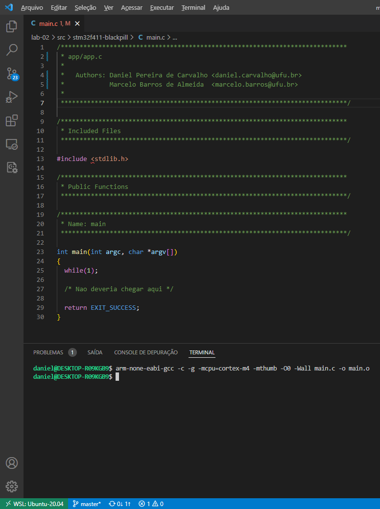

## 5 - O arquivo de inicialização

Ao desenvolver aplicações voltadas para sistemas operacionais como Windows,
Linux, MacOS ou até mesmos smartphones, normalmente não nos preocupamos com o
que acontece antes da chamada à nossa função principal, ***main()***.
Entretanto, se você estiver trabalhando com o desenvolvimento de sistemas
embarcados você deve ter esse tipo de conhecimento.

Quando um executável é carregado na memória o controle não vai imediatamente
para a função ***main()***, ele vai para uma rotina intermediária que executa
algumas tarefas tais como:

* Inicializar os *stacks*;
* Preparar os *streams* *stdin* / *stdout* / *stderr*;
* Adicionar ao stack os argumentos *argc* e *argv*, ou qualquer outro parâmetro
passado através do *shell*, para que a função *main()* possa utilizá-los;
* Se necessário, copiar o conteúdo da seção *.data* (*initialized data*) da
memória não volátil para a RAM;
* Se necessário, copiar o conteúdo da seção *.fast* da memória não volátil para
a RAM;
* Inicializa a seção *.bss* (*Block Started by Symbol*) em zero;
* Inicializa o *heap*;
* Realiza qualquer função necessária para preparação do sistema operacional ou
configuração que possa ser necessária;
* Chama a função *main()*.

Na arquitetura **ARM Cortex-M** além das tarefas descritas acima também devemos
realizar a alocação da tabela de vetores de interrupção na memória.

Visto que não possuimos nenhum Sistema Operacional para realizar estas 
atividades devemos prover o código necessário. Para isso, crie um novo arquivo
com o nome **startup.c**.

Para facilitar o desenvolvimento e o entendimento vamos dividir o código de 
inicialização em seções distintas são elas:

* declaração e inicialização do ***Stack***;
* declaração e inicialização da Tabela de Vetores de Interrupção;
* código do ***Reset Handler***;
* outros códigos ***Exception Handlers***.

A ***Stack***, ou pilha, é uma área da memória onde dados/variáveis ou
ponteiros são armazenados, de forma temporária, durante a execução de uma
função. Quando uma função é finalizada, o espaço utilizado na pilha é liberado.
Esta área funciona como uma estrutura de dados **LIFO**
(***Last In First Out***). Nos processadores **ARM Cortex-M** as operações na
***stack*** são baseadas no modelo totalmente descendente 
(***full-descending***). Isto significa que o ponteiro da pilha,
**stack pointer** ou **SP** sempre aponta para o último dado armazenado na
***stack*** e o **SP** é decrementado a cada operação de ***PUSH*** e
incrementado a cada operação de ***POP***.

Para maximizar a utilização da memória normalmente definimos o início da 
***stack*** nos processadores da arquitetura **ARM Cortex-M** apontando para o
final da memória **SRAM**. De acordo com o modelo de memória da arquitetura a
memória **SRAM** tem início no endereço **0x2000 0000** e, especificamente para
o processador **STM32F411**, termina no endereço **0x2001 FFFF**
(**128KB** de memória **SRAM**).

De posse destas informações podemos definir o endereço do início da **stack**
no arquivo **startup.c**. Perceba também que, a priori, o **SP** irá apontar
para uma área fora da **SRAM** (**0x2002 0000**) mas como ele será decrementado
e só depois a posição apontada será utilizada, a definição está correta.

Arquivo: **startup.c**
```c
#include <stdint.h>

#define SRAM_START  0x20000000U                  /* Inicio da SRAM CORTEX-M */
#define SRAM_SIZE   (128U * 1024U)               /* Tam. SRAM STM32F411 128K */
#define SRAM_END    ((SRAM_START) + (SRAM_SIZE)) /* Final da SRAM STM32F411 */

#define STACK_START SRAM_END                     /* Inicio da Stack */
```

Uma das principais características da arquitetura **ARM Cortex-M** é que ela é
capaz de carregar o endereço do **SP** diretamente da memória FLASH durante o
processo de **reset** da CPU. Para isso, é necessário que o endereço do **SP**
seja gravado no início da memória **FLASH**, seguido pelos vetores de
interrupção. Segundo a especificação da arquitetura **ARM Cortex-M** a memória
de programa começa no endereço **0x0000 0000**. No entanto, o fabricante que
utiliza o núcleo **ARM Cortex-M** pode criar mapeamentos adicionais, permitindo
que a partida seja feita de outros endereços. Uma estratégia comum é o emprego
de áreas espelhadas, como é feito pela fabricante **ST**. Os microcontroladores
da família **STM32** o endereço **0x0000 0000** é espelhado para o endereço
**0x0800 0000** dependendo do estado de pinos de configuração.

A especificação da arquitetura **ARM Cortex-M** reserva 15 vetores de 
interrupções destinados à exceções geradas pelo processador, chamadas de
**Built-in Exceptions**. Estes vetores são indexados de **1-15**. O índice
**0** não é um vetor de interrupção mas sim o valor inicial do **SP**. Essa foi
uma saída criada pela **ARM** para ter um stack pointer inicializado desde o
começo da execução do código, permitindo que toda a partida possa ser feita em
linguagem C.

Além dos vetores de interrupção da CPU a arquitetura também suporta linhas de
interrupção externas ao núcleo da CPU, **External Exceptions**. Estas linhas de
interrupção geralmente são roteadas para periféricos específicos do fabricante
do chip tais como **DMA** (*Direct Memory Access*), **GPIO**
(***General Purpose Input/Output***), etc. Todas estas interrupções são
configuradas por meio de um periférico conhecido como **NVIC**
(*Nested Vectored Interrupt Controller*). Um detalhe adicional é que o endereço
base desses vetores de interrupção pode ser alterado em núcleo **ARM Cortex-M3**
ou superior através do registro **VTOR - Vector Table Offset Register**.

Assim, no processo de partida, é preciso, minimamente, que se tenha o valor do
**SP** no endereço **0x0000 0000** e pelo menos o primeiro vetor de interrupção,
o **Reset Handler**, no endereço seguinte, **0x0000 0004**. O processador usará
o primeiro valor para configurar o **SP** e buscará no segundo o endereço da
rotina de inicialização do sistema. No entanto, é importante definir toda a
tabela de vetores de interrupção para evitar comportamentos inesperados em caso
de uma exceção não tratada.

Dessa forma, para atender este requisito da arquitetura devemos reservar no
início da memória **FLASH** espaço suficiente para armazenar toda a Tabela de
Vetores de Interrupção do dispositivo.

Podemos obter a tabela completa de Vetores de Interrupção do **STM32F411** no
Manual de Referência[2]. De acordo com a **Table 37. Vector table for**
**STM32F411xC/E** do manual a Tabela de Vetores de Interrupção inicia no
endereço **0x0000 0000**, com o endereço do ponteiro para o **SP**, seguido por
15 vetores de endereços para as rotinas de tratamento das **System Exceptions**
e por 86 endereços para as **External Interrupts**, interrupções ou eventos
gerados pelos periféricos. Considerando que o tamanho do endereço do vetor de
interrupção na arquitetura **Cortex-M** é de 4 bytes devemos reservar
**408 bytes** ou **102 words**. Isto pode ser feito facilmente em linguagem C
utilizando um **array** de **uint32_t**.

No momento vamos nos limitar a implementar a seção mínima do Vetor de 
Interruções, composta pelo **SP** e pelos 15 vetores de endereços para as
rotinas de tratamento das **System Exceptions**. 

Arquivo: **startup.c**
```c
#include <stdint.h>
.
.
.

uint32_t vectors[] =
{
  STACK_START,                            /* 0x0000 0000 */
  0,                                      /* 0x0000 0004 */
  0,                                      /* 0x0000 0008 */
  0,                                      /* 0x0000 000c */
  0,                                      /* 0x0000 0010 */
  0,                                      /* 0x0000 0014 */
  0,                                      /* 0x0000 0018 */
  0,                                      /* 0x0000 001c */
  0,                                      /* 0x0000 0020 */
  0,                                      /* 0x0000 0024 */
  0,                                      /* 0x0000 0028 */
  0,                                      /* 0x0000 002c */
  0,                                      /* 0x0000 0030 */
  0,                                      /* 0x0000 0034 */
  0,                                      /* 0x0000 0038 */
  0,                                      /* 0x0000 003c */
};
```

Observe que com exceção do endereço do **SP** todos os outros endereços foram
inicializados em zero. Fizemos isto para não termos que especificar o tamanho
que o **array** irá ocupar na memória deixando isto a cargo do compilador.

Além de reservar o espaço necessário para armazenar a Tabela de Vetores de
Interrupção precisamos garantir que ela seja alocada no início da memória 
**FLASH**, a partir do endereço **0x0000 0000**. A alocação de endereços é
realizada durante o processo de **linking** assim, devemos "informar" ao
**linker** que esta seção do código deve ir para uma região específica da
**FLASH**. Para isso, vamos solicitar ao compilador armazene o 
**array vectors[]** em uma nova seção.

De acordo com o manual do **GCC** seção **Common Variable Attributes** podemos
criar uma nova seção utilizando o atributo **section**. Perceba que essa é uma
diretiva exclusivamente do **GCC** e outros compiladores adotarão uma forma
alternativa de configuração da seção, sendo algo **não portável**.

Assim, para armazenar a Tabela de Vetores de Interrupção na seção
**.isr_vectors** podemos utilizar o seguinte código

Arquivo: **startup.c**
```c
.
.
.

uint32_t vectors[] __attribute__((section(".isr_vectors"))) =
{
  STACK_START,                            /* 0x0000 0000 */
  0,                                      /* 0x0000 0004 */
  0,                                      /* 0x0000 0008 */
  0,                                      /* 0x0000 000c */
  0,                                      /* 0x0000 0010 */
  0,                                      /* 0x0000 0014 */
  0,                                      /* 0x0000 0018 */
  0,                                      /* 0x0000 001c */
  0,                                      /* 0x0000 0020 */
  0,                                      /* 0x0000 0024 */
  0,                                      /* 0x0000 0028 */
  0,                                      /* 0x0000 002c */
  0,                                      /* 0x0000 0030 */
  0,                                      /* 0x0000 0034 */
  0,                                      /* 0x0000 0038 */
  0,                                      /* 0x0000 003c */
};
```
Para que nosso programa funcione de forma correta devemos, pelo menos, criar
uma rotina para tratamento da **Reset Exception** e adicionar seu endereço
logo após o endereço do **SP**. Esta rotina será responsável por copiar o 
conteúdo da seção **.data** (**Initialized Data**) da memória **FLASH** para a
**SRAM** e inicializar a seção **.bss** (**Block Started by Symbol**) em zero.
Vamos chamar esta rotina de **reset_handler()**.

O código abaixo adiciona o protótipo da função **reset_handler()**, seu
endereço no Vetor de Interrupções e o **stub**, ou a implementação vazia da
função.

Arquivo: **startup.c**
```c
.
.
.

void reset_handler(void);

uint32_t vectors[] __attribute__((section(".isr_vectors"))) =
{
  STACK_START,                            /* 0x0000 0000 */
  (uint32_t)reset_handler,                /* 0x0000 0004 */
  0,                                      /* 0x0000 0008 */
  0,                                      /* 0x0000 000c */
  0,                                      /* 0x0000 0010 */
  0,                                      /* 0x0000 0014 */
  0,                                      /* 0x0000 0018 */
  0,                                      /* 0x0000 001c */
  0,                                      /* 0x0000 0020 */
  0,                                      /* 0x0000 0024 */
  0,                                      /* 0x0000 0028 */
  0,                                      /* 0x0000 002c */
  0,                                      /* 0x0000 0030 */
  0,                                      /* 0x0000 0034 */
  0,                                      /* 0x0000 0038 */
  0,                                      /* 0x0000 003c */
};

void reset_handler(void)
{

}
```

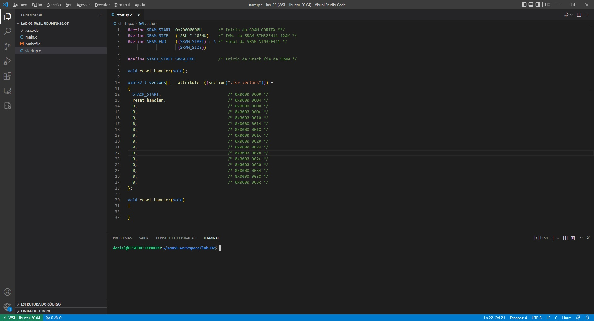

Agora que temos a estrutura da Tabela de Vetores de Interrupção implementada
podemos prosseguir com seu preenchimento. A próxima entrada da tabela é a rotina
de tratamento da **NMI**, chamaremos essa função de **nmi_handler()**. Visto
que não esperamos que esta exceção ou interrupção ocorra vamos apenas "travar" a
aplicação caso ela aconteça.

```c
.
.
.

void reset_handler(void);
void nmi_handler  (void);

uint32_t vectors[] __attribute__((section(".isr_vectors"))) =
{
  STACK_START,                            /* 0x0000 0000 */
  (uint32_t)reset_handler,                /* 0x0000 0004 */
  (uint32_t)nmi_handler,                  /* 0x0000 0008 */
  0,                                      /* 0x0000 000c */
  0,                                      /* 0x0000 0010 */
  0,                                      /* 0x0000 0014 */
  0,                                      /* 0x0000 0018 */
  0,                                      /* 0x0000 001c */
  0,                                      /* 0x0000 0020 */
  0,                                      /* 0x0000 0024 */
  0,                                      /* 0x0000 0028 */
  0,                                      /* 0x0000 002c */
  0,                                      /* 0x0000 0030 */
  0,                                      /* 0x0000 0034 */
  0,                                      /* 0x0000 0038 */
  0,                                      /* 0x0000 003c */
};

void reset_handler(void)
{

}

void nmi_handler(void)
{
  while(1){};
}
```

Devemos adicionar mais 15 rotinas de tratamento para as **System Exceptions** e
mais 86 para as rotinas de tratamento das **IRQs**, o que é uma tarefa
repetitiva e tediosa. Visto que na maioria das vezes não teremos um tratamento
específico para cada **System Exception** e que iremos utilizar apenas algumas
**IRQs** não faz sentido implementar todas as funções de tratamento.

Podemos simplificar este processo criando uma rotina de tratamento padrão para
todas as **System Exceptions** e **IRQs** não utilizadas. Para isso vamos criar
uma função chamada **default_handler()** e utilizar seu endereço na Tabela de
Vetores de Interrupção todas **System Exceptions** e **IRQs** que não
implementaremos.

```c
.
.
.

void reset_handler  (void);
void nmi_handler    (void);
void default_handler(void);

uint32_t vectors[] __attribute__((section(".isr_vectors"))) =
{
  STACK_START,                            /* 0x0000 0000 */
  (uint32_t)reset_handler,                /* 0x0000 0004 */
  (uint32_t)nmi_handler,                  /* 0x0000 0008 */
  (uint32_t)default_handler,              /* 0x0000 000c */
  (uint32_t)default_handler,              /* 0x0000 0010 */
  (uint32_t)default_handler,              /* 0x0000 0014 */
  (uint32_t)default_handler,              /* 0x0000 0018 */
  0,                                      /* 0x0000 001c */
  0,                                      /* 0x0000 0020 */
  0,                                      /* 0x0000 0024 */
  0,                                      /* 0x0000 0028 */
  (uint32_t)default_handler,              /* 0x0000 002c */
  (uint32_t)default_handler,              /* 0x0000 0030 */
  0,                                      /* 0x0000 0034 */
  (uint32_t)default_handler,              /* 0x0000 0038 */
  (uint32_t)default_handler,              /* 0x0000 003c */
};

void reset_handler(void)
{

}

void nmi_handler(void)
{
  while(1){};
}

void default_handler(void)
{
  while(1){};
}
```

O principal problema com essa abordagem é que sempre que necessitarmos de uma
rotina de tratamento especializada devemos modificar e recompilar o arquivo
**startup.c**. Felizmente, o compilador **GCC** possui recursos que permitem 
contornar esse inconveniente. Um dos recursos do **GCC** que utilizaremos é o
que permite atribuir um "apelido" à uma função, via atributo **alias**.

Vamos, inicialmente, remover a implementação da função **nmi_handler()** e
modificar seu o protótipo de forma que se torne um **alias** para a função
**default_handler()**.

```c
void nmi_handler    (void) __attribute__ ((alias("default_handler")));
```

Em seguida, iremos criar protótipos de função como **alias** para a função
**default_handler()** para todas as **System Exceptions** e adicioná-las à
Tabela de Vetores de Interrupção.

```c
.
.
.

void reset_handler     (void);
void nmi_handler       (void) __attribute__ ((alias("default_handler")));
void hardfault_handler (void) __attribute__ ((alias("default_handler")));
void memmanage_handler (void) __attribute__ ((alias("default_handler")));
void busfault_handler  (void) __attribute__ ((alias("default_handler")));
void usagefault_handler(void) __attribute__ ((alias("default_handler")));
void svc_handler       (void) __attribute__ ((alias("default_handler")));
void debugmon_handler  (void) __attribute__ ((alias("default_handler")));
void pendsv_handler    (void) __attribute__ ((alias("default_handler")));
void systick_handler   (void) __attribute__ ((alias("default_handler")));

uint32_t vectors[] __attribute__((section(".isr_vectors"))) =
{
  STACK_START,                            /* 0x0000 0000 */
  (uint32_t)reset_handler,                /* 0x0000 0004 */
  (uint32_t)nmi_handler,                  /* 0x0000 0008 */
  (uint32_t)hardfault_handler,            /* 0x0000 000c */
  (uint32_t)memmanage_handler,            /* 0x0000 0010 */
  (uint32_t)busfault_handler,             /* 0x0000 0014 */
  (uint32_t)usagefault_handler,           /* 0x0000 0018 */
  0,                                      /* 0x0000 001c */
  0,                                      /* 0x0000 0020 */
  0,                                      /* 0x0000 0024 */
  0,                                      /* 0x0000 0028 */
  (uint32_t)svc_handler,                  /* 0x0000 002c */
  (uint32_t)debugmon_handler,             /* 0x0000 0030 */
  0,                                      /* 0x0000 0034 */
  (uint32_t)pendsv_handler,               /* 0x0000 0038 */
  (uint32_t)systick_handler,              /* 0x0000 003c */
};

void reset_handler(void)
{

}

void default_handler(void)
{
  while(1){};
}
```

O atributo **alias** resolve o problema de termos que criar uma função de
tratamento para cada **System Exception** e **IRQ**. Entretanto, ainda teremos
que modificar o arquivo **startup.c** caso seja necessário uma função de
tratamento especializada. Para resolver este problema iremos utilizar o
atributo **weak**.

Um símbolo ou função definida como **weak** pode ser sobrescrita durante o
processo de **linking** por uma função com o mesmo nome sem o atributo **weak**
em outro arquivo **.c**. Isto faz com que o endereço utilizado na Tabela de
Vetores de Interrupção seja a da nova função, não mais o endereço da função
**default_handler()**, sem a necessidade de alterar mais nada no arquivo **startup.c**.

```c
.
.
.

void reset_handler     (void);
void nmi_handler       (void) __attribute__ ((weak, alias("default_handler")));
void hardfault_handler (void) __attribute__ ((weak, alias("default_handler")));
void memmanage_handler (void) __attribute__ ((weak, alias("default_handler")));
void busfault_handler  (void) __attribute__ ((weak, alias("default_handler")));
void usagefault_handler(void) __attribute__ ((weak, alias("default_handler")));
void svc_handler       (void) __attribute__ ((weak, alias("default_handler")));
void debugmon_handler  (void) __attribute__ ((weak, alias("default_handler")));
void pendsv_handler    (void) __attribute__ ((weak, alias("default_handler")));
void systick_handler   (void) __attribute__ ((weak, alias("default_handler")));

uint32_t vectors[] __attribute__((section(".isr_vectors"))) =
{
  STACK_START,                            /* 0x0000 0000 */
  (uint32_t)reset_handler,                /* 0x0000 0004 */
  (uint32_t)nmi_handler,                  /* 0x0000 0008 */
  (uint32_t)hardfault_handler,            /* 0x0000 000c */
  (uint32_t)memmanage_handler,            /* 0x0000 0010 */
  (uint32_t)busfault_handler,             /* 0x0000 0014 */
  (uint32_t)usagefault_handler,           /* 0x0000 0018 */
  0,                                      /* 0x0000 001c */
  0,                                      /* 0x0000 0020 */
  0,                                      /* 0x0000 0024 */
  0,                                      /* 0x0000 0028 */
  (uint32_t)svc_handler,                  /* 0x0000 002c */
  (uint32_t)debugmon_handler,             /* 0x0000 0030 */
  0,                                      /* 0x0000 0034 */
  (uint32_t)pendsv_handler,               /* 0x0000 0038 */
  (uint32_t)systick_handler,              /* 0x0000 003c */
};

void reset_handler(void)
{

}

void default_handler(void)
{
  while(1){};
}
```

Para maiores informações sobre como utilizar os atributos **alias** e **weak**
consulte o manual do **GCC** seção **Common Variable Attributes**.

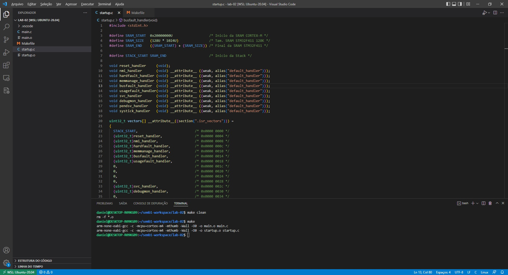

Após finalizarmos a Tabela de Vetores de Interrupção iremos escrever o código
de inicialização na função **reset_handler()**. Esta função deve, no mínimo,
realizar as seguintes tarefas:

* copiar os dados da seção **.data** para a memória SRAM;
* preencher com zero a seção **.bss**, e;
* chamar a função **main()**.

Para copiar os dados da seção **.data** armazenada na FLASH para o local correto
na memória SRAM precisamos conhecer os limites desta seção na FLASH e o endereço
da memória SRAM para onde devemos realizar a cópia. Analogamente, para preencher
com zero a seção **.bss** também precisaremos dos limites desta seção. Estas
informações estarão disponíveis durante o processo de **linking**, sendo criadas através de um script de **linking**, ou
o *linker script*. Assim, neste momento, iremos apenas definir estas variáveis no
arquivo *startup.c* como externas à este este arquivo.

```c
.
.
.
void reset_handler    (void);
void nmi_handler      (void) __attribute__ ((weak, alias("default_handler")));
void hardfault_handler(void) __attribute__ ((weak, alias("default_handler")));
.
.
.
void systick_handler   (void) __attribute__ ((weak, alias("default_handler")));

/* Variaveis exportadas pelo linker script */

extern uint32_t _sdata;     /* Inicio da secao .data */
extern uint32_t _edata;     /* Fim da secao .data */
extern uint32_t _la_data;   /* Endereco de carga na RAM da secao .data */

extern uint32_t _sbss;      /* Inicio da secao .bss */
extern uint32_t _ebss;      /* Fim da secao .bss */
.
.
.
```

Copiar os dados da seção **.data** para a memória SRAM é bastante simples, basta
iterarmos por toda a seção na memória FLASH e copiar os dados para o endereço
de destino na memória SRAM. Da mesma forma, para escrever zero na seçao **.bss**
iremos iterar por toda a seção na SRAM escrevendo zero em cada posição. Ao final
deste processo basta chamar a função **main()**. Lembre que a função **main()**
será implementada em outro arquivo logo, é necessário definirmos seu protótipo.

```c
.
.
.

int main(void);

void reset_handler    (void);
void nmi_handler      (void) __attribute__ ((weak, alias("default_handler")));
void hardfault_handler(void) __attribute__ ((weak, alias("default_handler")));
.
.
.
void systick_handler   (void) __attribute__ ((weak, alias("default_handler")));

extern uint32_t _sdata;     /* Inicio da secao .data */
extern uint32_t _edata;     /* Fim da secao .data */
extern uint32_t _la_data;   /* Endereco de carga na RAM da secao .data */

extern uint32_t _sbss;      /* Inicio da secao .bss */
extern uint32_t _ebss;      /* Fim da secao .bss */

uint32_t vectors[] __attribute__((section(".isr_vectors"))) =
{
  STACK_START,
.
.
.
};

void reset_handler()
{
  uint32_t i; 

  /* Copia a secao .data para a RAM */
   
  uint32_t size = (uint32_t)&_edata - (uint32_t)&_sdata;
  uint8_t *pDst = (uint8_t*)&_sdata;                      /* SRAM */
  uint8_t *pSrc = (uint8_t*)&_etext;                      /* FLASH */
  
  for(i = 0; i < size; i++)
  {
    *pDst++ = *pSrc++;
  }

  /* Preenche a secao .bss com zero */

  size = (uint32_t)&_ebss - (uint32_t)&_sbss;
  pDst = (uint8_t*)&_sbss;
  for(i = 0 ; i < size; i++)
  {
    *pDst++ = 0;
  }

  /* Chama a funcao main() */

  main();
}

void default_handler(void)
{
  while(1){};
}
```

## 6 - Automatizar o processo de compilação

De maneira geral, ao se compilar um programa em linguagem C, devemos passar para
o compilador uma série de parâmetros. Estes parâmetros são utilizados ajustar
a arquitetura, nível de otimização, adicionar ao código objeto informações de
*debug*, tipos de avisos (*warnings*) que serão gerados, etc. Além disso, a
grande maioria dos programas são compostos por diversos arquivos fonte. Todos
estes fatores tornam o processo de compilação manual bastante complicado e
sujeito a erros.

Para contornar este problema diversas ferramentas foram desenvolvidas. Dentre
elas podemos destacar o utilitário **make**. Existem diversas implementações do
utilitário **make**. Entretanto, este material foi desenvolvido especificamente
para o **GNU make**, que é a implementação padrão no Linux e no MacOS. 
Para maiores informações acesse o manual do 
**[GNU make](https://www.gnu.org/software/make/manual/html_node/index.html).**

O **make** compila automaticamente programas e bibliotecas utilizando instruções
contidas em arquivos denominados *Makefile*. As instruções contidas no arquivo
*Makefile* contém cinco tipos de elementos: regras explícitas 
(*explicit rules*), regras implícitas (*implicit rules*), definições de 
variáveis (*variable definitions*), diretivas (*directives*) e comentários
(*comments*).

* **regra explícita**: diz quando e como refazer um ou mais aquivos, chamados
de alvos da regra (*rules's targets*). Ela lista os arquivos dos quais os alvos
(*targets*) dependem, chamados de pré-requisitos do alvo. Também pode fornecer
instruções ou uma receita para criar ou atualizar os alvos.

* **regra implícita**: diz quando e como refazer uma classe de arquivos com
base em seus nomes. Ele descreve como um alvo pode depender de um arquivo com
um nome semelhante ao alvo e fornece uma receita para criar ou atualizar este
alvo.

* **definição de variável**: é uma linha que especifica um valor de string de
texto para uma variável que pode ser substituída no texto posteriormente.

* **diretiva**: é uma instrução para o **make** fazer alguma coisa especial
enquanto lê o arquivo *Makefile*. Por exemplo, ler outro *Makefile*, decidir
quando usar ou ignorar uma parte do *Makefile*, etc.

* **comentários**: o caractere # em uma linha do *Makefile* marca o início de
um comentário. O caractere # e o resto da linha são ignorados pelo **make**.

A regra informa ao **make** duas coisas: quando um *target* está desatualizado
e como fazer para atualizá-lo. O critério para determinar se um *target* está
desatualizado são os *prerequisites*. Um *target* está desatualizado se ele não
existe ou se é mais antigo que qualquer um dos *prerequisites*. Como atualizar
o *target* é especificado pela *recipe*.

Um regra possui o seguinte formato:

```mak
targets: prerequisites
	recipe
```

Os *targets* e *prerequisites* são nomes de arquivos separados por espaços.
Normalmente utilizamos apenas um *target* por regra, mas ocasionalmente podemos
ter mais de um. A linha da *recipe* deve, necessariamente, começar com uma
tabulação.

Para compilar o arquivo **main.c** utilizando o **make**, crie um novo arquivo
denominado *Makefile*.

Para escrevermos a regra para compilar o arquivo **main.c** vamos utilizar a
linha de comando utilizada anteriormente para gerar o arquivo objeto *main.o*

```console
foo@bar$ arm-none-eabi-gcc -c -mcpu=cortex-m4 -mthumb main.c -o main.o
```

O *target* da regra é o arquivo objeto que desejamos gerar, neste caso, o
arquivo **main.o**. Para gerar o arquivo objeto dependemos, obviamente, do
arquivo **main.c**, logo, nossos *prerequisites* deve incluir no mínimo do
arquivo **main.c**. A *recipe* é a linha de comando que deve ser utilizada
para gerar o arquivo alvo, ou seja, toda a linha de comando.

A regra para compilar o arquivo **main.c** será

```mak
main.o: main.c
	arm-none-eabi-gcc -c -g -mcpu=cortex-m4 -mthumb -O0 -Wall main.c -o main.o
```

Antes de compilar o arquivo **main.c** utilizando o comando **make** remova o
arquivo **main.o**

```console
foo@bar$ rm -f main.o
```

ou, para remover todos os arquivos que terminam com a extensão **.o**

```console
foo@bar$ rm -f main.o
```

Agora compile novamente utilizando o comando **make**. Observe que a saída
produzida pelo comando **make** foi exatamente mesma linha que utilizamos
para compilar nosso programa manualmente.

```console
foo@bar$ make
```

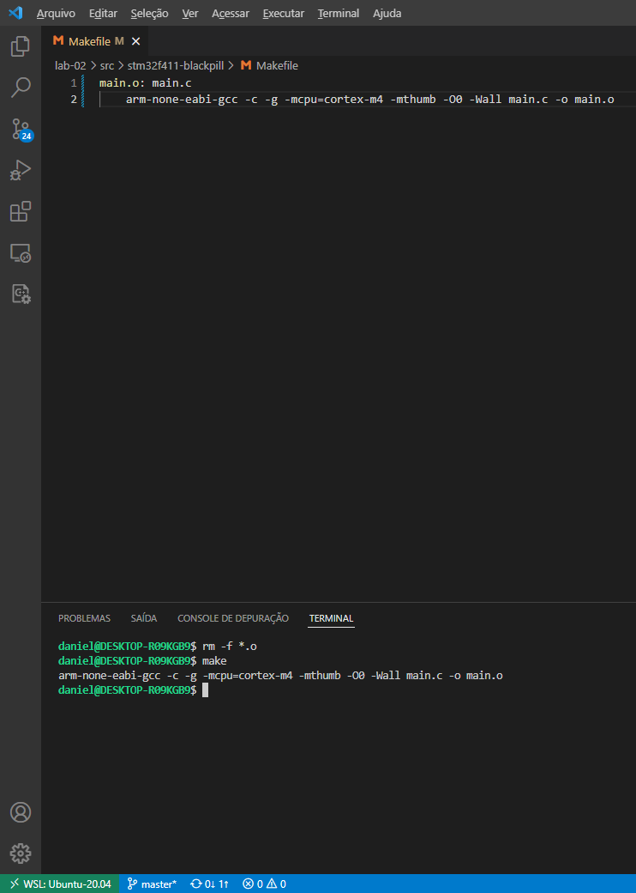

Se executarmos novamente o comando **make**, sem alterar o arquivo **main.c**,
notaremos que o **make** não executa a regra. E não existe razão para isso pois
o arquivo **main.o** está atualizado.

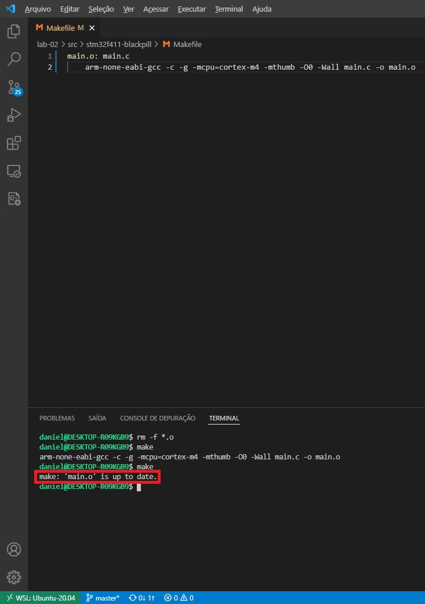

Esta funcionalidade é muito importante quando se trata de projetos grandes com
dezenas e até mesmo centenas de arquivos. O **make** irá compilar apenas os
arquivos que estão desatualizados.

Agora que temos o arquivo *Makefile* minimamente funcional, iremos realizar
algumas modificações para torná-lo ainda melhor. Primeiramente, vamos incluir
um *target* que nos permita remover os arquivos objeto gerados na compilação.
Iremos chamar este *target* de *clean*.

O comando para remover o arquivo *main.o* é

```console
foo@bar$ rm -f main.o
```

ou, para remover todos os arquivos objetos terminados em **.o**

```console
foo@bar$ rm -f *.o
```

Assim, podemos adicionar a nova regra para remover os arquivos objetos gerados
durantea o processo de compilação ao final do nosso **Makefile**.

```mak
main.o: main.c
	arm-none-eabi-gcc -c -mcpu=cortex-m4 -mthumb main.c -o main.o

clean:
	rm -f *.o
```

E para remover os arquivos objetos gerados pela compilação podemos executar o comando:

```console
foo@bar$ make clean
```

É boa prática substituir o nome do compilador e as opções de compilação por variáveis.
Isto garante que, caso necessário, todos os *targets* de um projeto sejam compilados
da mesma forma.

Podemos criar uma variável no **Makefile** utilizando a sintaxe *'VAR = VALUE'*.
Vamos criar duas variáveis, uma com o nome **CC** (*C Compiler*) e atribuir a
ela o nome do executável do compilador e a outra com nome de **CFLAGS** com os
parâmetros de compilação.

Vamos substituir o nome do compilador e os parâmetros de compilação da regra de
**main.o** pelas variáveis recém criadas. Para utilizar uma variável utilizamos
a sintaxe *'$(VAR)'*.

Arquivo: **Makefile**
```mak
CC = arm-none-eabi-gcc
CFLAGS = -g -mcpu=cortex-m4 -mthumb -O0 -Wall

main.o: main.c
	$(CC) -c $(CFLAGS) main.c -o main.o

clean:
	rm -f *.o
```

Para tornar nosso **Makefile** ainda mais genérico faremos o uso de variáveis
automáticas. Essas variáveis são automáticas pois substituem dentro das regras
os valores pelo valor que elas representam. Dentre as diversas variáveis 
automáticas que O **make** possui vamos utilizar duas. A variável automática
**\$<** que representa o primeiro elemento da lista de pré-requisitos e a 
variável **\$@** representa o alvo da regra. Logo, podemos modificar nosso
arquivo para:

Arquivo: **Makefile**
```mak
CC = arm-none-eabi-gcc
CFLAGS = -g -mcpu=cortex-m4 -mthumb -O0 -Wall

main.o: main.c
	$(CC) -c $(CFLAGS) $< -o $@

clean:
	rm -f *.o
```

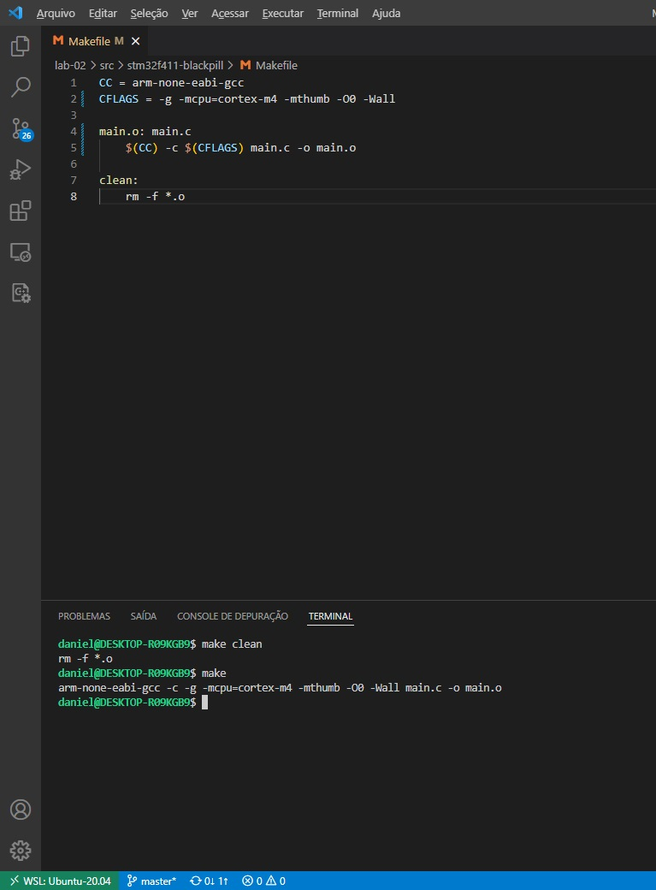

Agora que temos um arquivo **Makefile** minimamente funcional podemos adicionar
uma regra para compilar o arquivo **startup.o**. Por analogia vamos copiar a
regra e a receita de **main.o** substituindo apenas o nome do arquivo.

Arquivo: **Makefile**
```mak
CC = arm-none-eabi-gcc
CFLAGS = -g -mcpu=cortex-m4 -mthumb -O0 -Wall

main.o: main.c
	$(CC) -c $(CFLAGS) $< -o $@

startup.o: startup.c
	$(CC) -c $(CFLAGS) $< -o $@

clean:
	rm -f *.o
```

Caso execute este **Makefile** você irá notar que apenas o primeiro **target**
é executado. Para contornar este problema vamos criar um novo **target**
denominado **all** e colocar como dependências todos os arquivos objetos que
desejamos gerar.

Arquivo: **Makefile**
```mak
CC = arm-none-eabi-gcc
CFLAGS = -g -mcpu=cortex-m4 -mthumb -Wall -O0

all: startup.o main.o

main.o: main.c
	$(CC) -c $(CFLAGS) $< -o $@

startup.o: startup.c
	$(CC) -c $(CFLAGS) $< -o $@

clean:
	rm -f *.o
```

Agora, podemos compilar os arquivos **startup.c** e **main.c** utilizando o
comando

```console
foo@bar$ make all
```

ou simplesmente

```console
foo@bar$ make
```

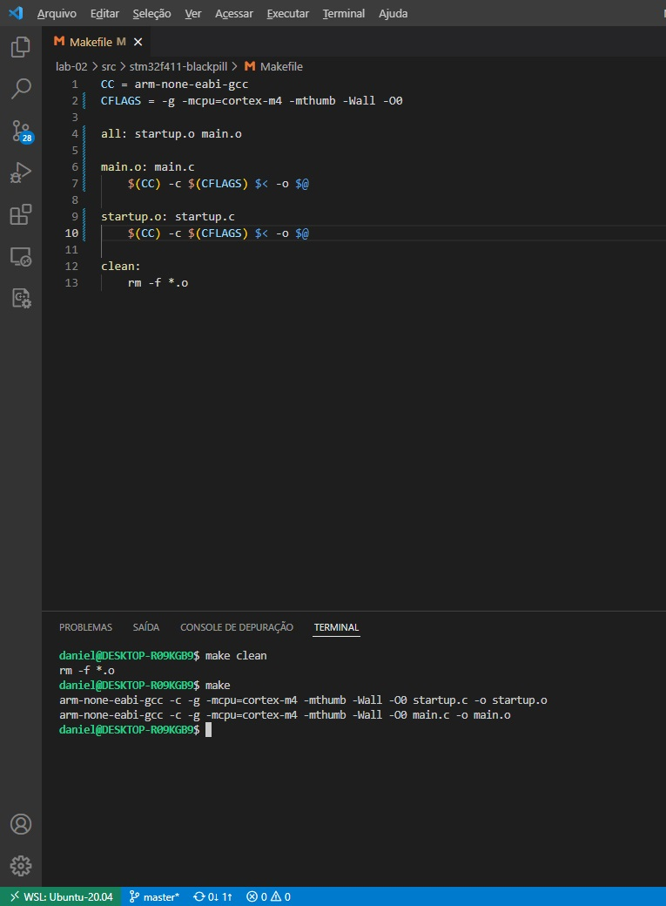

Observe que com exceção do nome do **target** e dos **prerequisites**, a regra
para os dois arquivos é a mesma. Podemos tornal nosso **Makefile** ainda mais
flexível utilizando os **wildcards** para criar padrões para os **targets** e
**prerequisites**. Estes padrões são chamados de **target-pattern** e
**prereq-patterns**.

Durante o execução da regra cada **target** é comparado com o **target-pattern**
para extrair a parte do nome do **target**. Em seguida, o **make** utiliza este
nome para construir a lista de pré-requisitos. Cada padrão ou **pattern** é
constituído, normalmente, por um caractere **%**.

Por exemplo, os **targets** **main.o** e **startup.o** terminam em **.o** logo,
podemos construir o **target-pattern** **%.o** onde, o caractere **%** 
representa o nome dos arquivo. A lista de pré-requisitos é composta pelo nome
do **target** acrescido da extensão **.c** logo, o **prereq-patterns** será
**%.c**.

Podemos substituir as duas regras do nosso **Makefile** por uma única regra
baseada nos **target-pattern** e **prereq-pattern** como mostrado abaixo.

Arquivo: **Makefile**
```mak
CC = arm-none-eabi-gcc
CFLAGS = -g -mcpu=cortex-m4 -mthumb -Wall -O0

all: startup.o main.o

%.o: %.c
	$(CC) -c $(CFLAGS) $< -o $@

clean:
	rm -f *.o
```

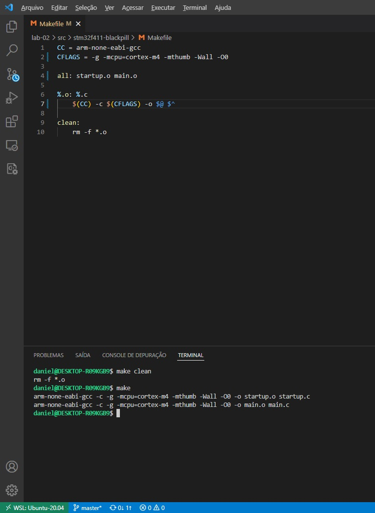

Para tornar o **Makefile** ainda melhor vamos gerar a lista de objetos que
desejamos compilar partindo de uma lista de arquivos **.c**. Para isso iremos
utilizar funções **basename** e **patsubst** do **make**. A função **basename**
é uma função para processar nome de arquivos. Ela retorna apenas o nome do
arquivo, removendo qualquer sufixo ou extensão. A sintaxe da função
**basename** é:

```mak
$(basename names…)
```

A função **patsubst** procura por palavras, separadas por espaço, que combinam
com um padrão e substitui o padrão com um texto. A sintaxe da função 
**patsubst** é:

```mak
$(patsubst pattern,replacement,text)
```

O parâmetro *text* será uma string com a lista de arquivos **.c** que iremos
compilar, utilizaremos a função **basename** na lista de arquivos para
remover a extensão dos arquivos. O parâmetro *replacement* será a *string*
que substituirá o padrão, Iremos anexar o sufixo **.o** ao padrão. Por fim,
o parâmetro *pattern* é o padrão que iremos buscar. No nosso caso queremos
todo o nome do arquivo, logo usaremos o **wildcard** **%**. Segue o arquivo
**Makefile** modificado.

Arquivo: **Makefile**
```mak
# Ferramentas do toolchain

CC = arm-none-eabi-gcc

# Arquivos a serem compilados

SRCS = startup.c \
        main.c

#Flags do compilador e linker

CFLAGS = -g -mcpu=cortex-m4 -mthumb -Wall -O0

# Gera uma lista de arquivos objeto utilizando os arquivos fonte

OBJS = $(patsubst %, %.o, $(basename $(SRCS)))

all: $(OBJS)

%.o: %.c
	$(CC) -c $(CFLAGS) $< -o $@

clean:
	rm -f *.o
```

Outra funcionalidade que podemos adicionar ao nosso **Makefile** é salvar os
arquivos objeto em um diretório diferente dos arquivos do código fonte.
Primeiro, criamos uma variável para armazenar o nome do diretório onde iremos
salvar os arquivos objeto. Em seguida instruímos o **make** a criar o diretório
para salvar os arquivos objeto. Isto é necessário pois o **GCC** não cria
diretórios automaticamente. O próximo passo é modificar a função que gera a
lista de objetos para incluir, além do sufixo, o diretório onde queremos salvar
os arquivos objeto. Finalmente, devemos alterar o nome do **target** para 
incluir o diretório. Vamos modificar também a regra **clean** para excluir
o diretório que armazena os arquivos objeto. Nosso **Makefile** ficará da
seguinte forma:

Arquivo: **Makefile**
```mak
# Ferramentas do toolchain

CC = arm-none-eabi-gcc
RM = rm -rf

# Diretorios arquivos objeto serao salvos

OBJDIR = build

# Arquivos a serem compilados

SRCS = startup.c \
        main.c

#Flags do compilador e linker

CFLAGS = -g -mcpu=cortex-m4 -mthumb -Wall -O0

# Gera uma lista de arquivos objeto utilizando os arquivos fonte

OBJS = $(patsubst %, $(OBJDIR)/%.o, $(basename $(SRCS)))

# Cria diretorios onde serao armazenados arquivos objeto

$(shell mkdir -p $(dir $(OBJS)) > /dev/null)

all: $(OBJS)

$(OBJDIR)/%.o: %.c
	$(CC) -c $(CFLAGS) $< -o $@

clean:
	$(RM) $(OBJDIR)
```

O programa que estamos desenvolvendo é bastante simples e determinar a lista de
dependências não é uma tarefa complexa. Entretanto, à medida que os programas
crescem e se tornam mais complexos esta lista de depedências deixa de ser tão
evidente. Para auxiliar o programador nesta tarefa os compiladores modernos
podem gerar a lista de depedências automaticamente durante a fase de 
pré-processamento.

Vamos criar e adicicionar o arquivo de cabeçalho **config.h** ao arquivo
**main.c**. Inicialmente, não será necessário adicionar nenhum conteúdo ao
arquivo **config.h**.

Arquivo: **main.c**
```c
#include <stdlib.h>

#include "config.h"

int main(int argc, char *argv[])
{
  while(1){};

  /* Nao deveria chegar aqui */

  return EXIT_SUCCESS;
}
```

Podemos solicitar que o **GCC** gere, como resultado do pré-processamento a
lista de dependências de um determinado arquivo utilizando a opção **-M**. Por
exemplo, para verificar a lista de depedências do arquivo **main.c** execute o
seguinte comando:

```console
foo@bar$ arm-none-eabi-gcc -M main.c
```

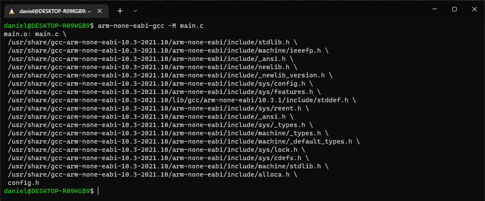

Observe que, na lista de dependências temos o arquivo **main.c**, o arquivo
**config.h** além de diversos arquivos que pertencentem ao sistema. Normalmente
não alteramos arquivos que pertencem ao sistema logo, podemos excluí-los da
lista de dependências. Para isso, podemos utlizar a opção **-MM** que gera uma
lista de depedências contendo apenas arquivos do usário, sem adicionar aquivos
cabeçalhos do sistema mencionados direta ou indiretamente.

```console
foo@bar$ arm-none-eabi-gcc -MM main.c
```

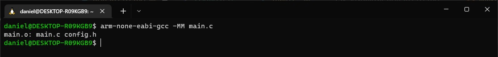

Podemos salvar a lista de depedências gerada pelo **GCC** em um arquivo
acrescentando a opção **-MF** ***file***. Assim como criamos um diretório para
armazenar todos os arquivos objeto vamos salvar os arquivos das listas de
dependências em um diretório específico, por exemplo, o diretório **.deps**.

```console
foo@bar$ mkdir .deps
foo@bar$ arm-none-eabi-gcc -MM -MF .deps/main.d main.c
foo@bar$ ls .deps/
foo@bar$ cat .deps/main.d
```

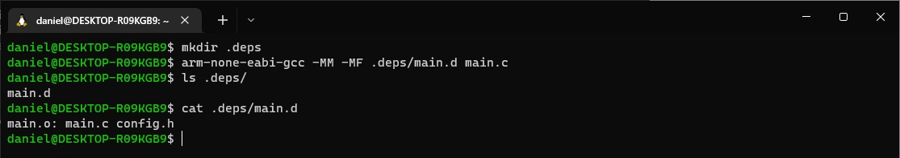

O comando acima gera um arquivo contendo a lista de depedências ao invés ao
invés de compilar o arquivo fonte. O **GCC** é capaz de gerar a lista de
depedências como subproduto do processo de compilação. Para isso, devemos
utilizar a opção **-MMD**.

```console
foo@bar$ rm -rf .deps/*
foo@bar$ rm -rf build/*
foo@bar$ arm-none-eabi-gcc -c -g -mcpu=cortex-m4 -mthumb -Wall -O0 \
> -MMD -MF .deps/main.d main.c -o build/main.o
foo@bar$ ls build/
foo@bar$ cat .deps/main.d
```

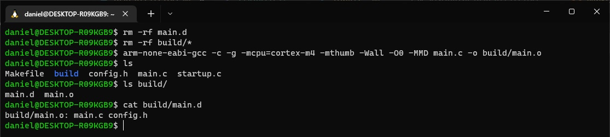

Como pode perceber o **GCC** compilou o arquivo **main.c** e, como subproduto
da compilação, criou o arquivo com a lista de dependências no diretório
especificado.

Agora que temos um comando, ou regra, que compila e gera a lista de dependências
podemos modificar no arquivo **Makefile**. Vamos começar criando uma variável
para armazenar o diretório que irá armazenar os arquivos das listas de
dependências e, caso necessário criar este diretório.

```mak
DEPDIR = .deps
```

```mak
$(shell mkdir -p $(dir $(DEPS)) > /dev/null)
```

Tendo como ponto de partida o comando utilizado podemos criar uma variável para
armazenar as flags utilizados para gerar a lista de dependências.

```mak
DEPFLAGS = -MMD -MP -MF $(DEPDIR)/$*.d
```

A variável automática **$\*** é utilizada para extrair a raiz com a qual uma
regra implícita corresponde. Por exemplo, considere um **target** com o nome
**$(OBJDIR)/main.o** e com a regra implícita **$(OBJDIR)/%.o** terá como raiz
**main**. Assim ao se executar a regra do **target** **main.o** as flags acima
serão interpretadas como:

```mak
DEPFLAGS = -MMD -MP -MF $(DEPDIR)/main.d
```

Agora vamos adicionar o arquivo ***.d** à lista de dependências do **target**,
incluir as flags de dependência na recita e excluir os arquivos de dependência
gerados no **target** **clean**.

```mak
$(OBJDIR)/%.o: %.c $(DEPDIR)/%.d
	$(CC) -c $(CFLAGS) $(DEPFLAGS) $< -o $@
```

```mak
.PHONY: clean
clean:
	$(RM) $(OBJDIR) $(DEPDIR)
```

Neste momento o arquivo **Makefile** ficará da seguinte forma:

Arquivo: **Makefile**
```mak
# Ferramentas do toolchain

CC = arm-none-eabi-gcc
RM = rm -rf

# Diretorios arquivos objeto e de lista de dependencias serao salvos

OBJDIR = build
DEPDIR = .deps

# Arquivos a serem compilados

SRCS = startup.c \
        main.c

#Flags do compilador e linker

CFLAGS = -g -mcpu=cortex-m4 -mthumb -Wall -O0
DEPFLAGS = -MMD -MP -MF $(DEPDIR)/$*.d

# Gera lista de arquivos objeto e cria diretorio onde serao salvos

OBJS = $(patsubst %, $(OBJDIR)/%.o, $(basename $(SRCS)))
$(shell mkdir -p $(dir $(OBJS)) > /dev/null)

# Gera lista de arquivos de lista dependencia e cria diretorio onde serao salvos

DEPS = $(patsubst %, $(DEPDIR)/%.d, $(basename $(SRCS)))
$(shell mkdir -p $(dir $(DEPS)) > /dev/null)

all: $(OBJS)

$(OBJDIR)/%.o: %.c $(DEPDIR)/%.d
	$(CC) -c $(CFLAGS) $(DEPFLAGS) $< -o $@

.PHONY: clean
clean:
	$(RM) $(OBJDIR) $(DEPDIR)
```

Se tentarmos rodar o **make** agora ele irá falhar visto que os arquivos objeto
dependem dos arquivos **.d** e não existe regra para criá-los. Lembre-se que
estes arquivos são gerados como subproduto do processo de compilação.

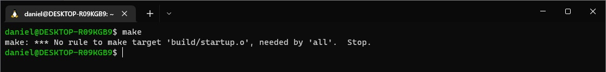

Para evitar que o **make** falhe ao tentarmos gerar um **target** que ainda não
existe precisamos criar um novo **target** para cada arquivo de dependência
possível. Por exemplo, podemos criar um novos **targets** para os arquivos
**startup.d** e **main.d** da seguinte maneira:

```mak
.deps/startup.d:

.deps/main.d:
```

Isto certamente faria o **make** funcionar mas teríamos que adicionar uma nova
regra para cada arquivo fonte que adicionarmos ao programa. Podemos tornar isto
genérico criando uma regra implícita para o **target** da seguinte forma:

```mak
$(DEPS):
```

Neste momento o **Makefile** encontra-se da seguinte maneira:

Arquivo: **Makefile**
```mak
# Ferramentas do toolchain

CC = arm-none-eabi-gcc
RM = rm -rf

# Diretorios arquivos objeto e de lista de dependencias serao salvos

OBJDIR = build
DEPDIR = .deps

# Arquivos a serem compilados

SRCS = startup.c \
        main.c

#Flags do compilador e linker

CFLAGS = -g -mcpu=cortex-m4 -mthumb -Wall -O0
DEPFLAGS = -MMD -MF $(DEPDIR)/$*.d

# Gera lista de arquivos objeto e cria diretorio onde serao salvos

OBJS = $(patsubst %, $(OBJDIR)/%.o, $(basename $(SRCS)))
$(shell mkdir -p $(dir $(OBJS)) > /dev/null)

# Gera lista de arquivos de lista dependencia e cria diretorio onde serao salvos

DEPS = $(patsubst %, $(DEPDIR)/%.d, $(basename $(SRCS)))
$(shell mkdir -p $(dir $(DEPS)) > /dev/null)

all: $(OBJS)

$(OBJDIR)/%.o: %.c $(DEPDIR)/%.d
	$(CC) -c $(CFLAGS) $(DEPFLAGS) $< -o $@

# Cria um novo target para cada arquivo de dependencia possivel

$(DEPS):

build/main.o: main.c config.h

.PHONY: clean
clean:
	$(RM) $(OBJDIR) $(DEPDIR)
```

Para verificar se o **make** está rodando sem erros e o **Makefile** está
funcionando de acordo com o esperado execute os seguintes comandos:

```
foo@bar$ make clean
foo@bar$ make
```

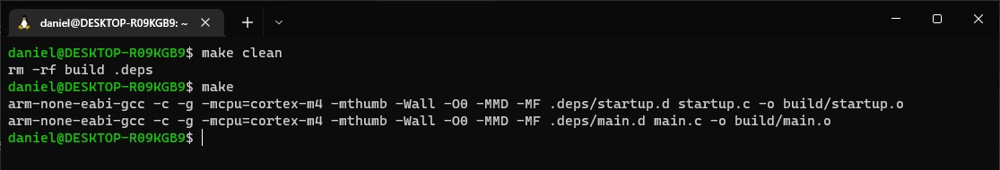

Caso alterarmos o arquivo **config.h** esperamos que um novo arquivo objeto
**build/main.o** seja gerado. Assim, vamos alterar o arquivo **config.h** e
compilar o programa novamente para verificar se está funcionando.

```
foo@bar$ touch config.h
foo@bar$ make
```

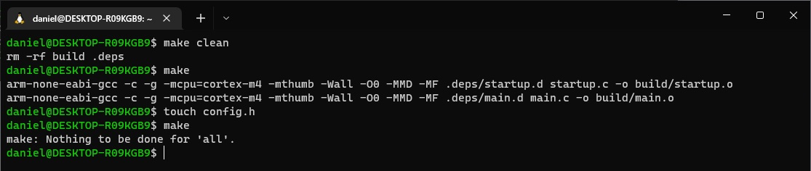

Como você pode observar apesar de termos alterado o arquivo **config.h** o
**make** não compilou o arquivo **main.c** novamente. Isto acontece porque de
acordo com a regra atual o **target** **build/main.o** depende de **main.c**
e **.deps/main.d** e não da lista de dependências contida em **.deps/main.d**.
Precisamos encontrar alguma forma de adicionar esta lista à lista de 
dependências do **target**.

Podemos adicionar uma ou mais depedências à um **target** criando um outro com
o mesmo nome mas sem nenhuma regra. Se observarmos o conteúdo de 
**.deps/main.d** veremos que a lista de depedências inicia pelo nome do 
**target** e é seguida pelos arquivos dos quais o **target** depende na mesma
sintaxe utilizada pelo **make**.

Arquivo: **.deps/main.d**
```
build/main.o: main.c config.h
```

Assim, para acrescentarmos esta lista de dependências ao **target**
**build/main.o** basta adicionar o conteúdo de **.deps/main.d** ao
ao final do arquivo **Makefile**. Devemos fazer isso para todos os
arquivos de dependência.

Arquivo: **Makefile**
```mak
# Ferramentas do toolchain

CC = arm-none-eabi-gcc
RM = rm -rf

# Diretorios arquivos objeto e de lista de dependencias serao salvos

OBJDIR = build
DEPDIR = .deps

# Arquivos a serem compilados

SRCS = startup.c \
        main.c

#Flags do compilador e linker

CFLAGS = -g -mcpu=cortex-m4 -mthumb -Wall -O0
DEPFLAGS = -MMD -MF $(DEPDIR)/$*.d

# Gera lista de arquivos objeto e cria diretorio onde serao salvos

OBJS = $(patsubst %, $(OBJDIR)/%.o, $(basename $(SRCS)))
$(shell mkdir -p $(dir $(OBJS)) > /dev/null)

# Gera lista de arquivos de lista dependencia e cria diretorio onde serao salvos

DEPS = $(patsubst %, $(DEPDIR)/%.d, $(basename $(SRCS)))
$(shell mkdir -p $(dir $(DEPS)) > /dev/null)

all: $(OBJS)

$(OBJDIR)/%.o: %.c $(DEPDIR)/%.d
	$(CC) -c $(CFLAGS) $(DEPFLAGS) $< -o $@

# Cria um novo target para cada arquivo de dependencia possivel

$(DEPS):

# Inclui conteudo dos arquivos de dependencia

build/startup.o: startup.c
build/main.o: main.c config.h

.PHONY: clean
clean:
	$(RM) $(OBJDIR) $(DEPDIR)
```

Para checar se agora o **Makefile** está funcionando como desejado execute os
comandos:

```
foo@bar$ make clean
foo@bar$ make
foo@bar$ touch config.h
foo@bar$ make
```

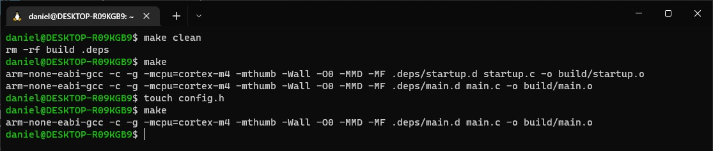

Novamente, esta abordagem resolveu o problema mas não é genérica o suficiente.
Para incluir o conteúdo de um arquivo no **make** utilizamos a diretiva
**include**. Assim, para incluir todos os arquivos de dependência podemos
escrever:

```mak
-include $(DEPS)
```

o sinal **-** foi adicionado para o **make** ignorar arquivos que não existem.

Caso excluirmos um arquivo da lista de dependências esperamos que o **target**
seja recompilado.

```
foo@bar$ rm -rf config.h
foo@bar$ make
```

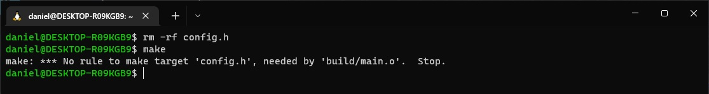

Como pode verificar, o **make** falhou. Esta falha ocorreu pois o arquivo
**config.h** faz parte da lista de dependências do arquivo **.deps/main.d**.
Para resolver este tipo de falha devemos criar um **target** vazio para cada
arquivo de cabeçalho da lista de dependências. Este **target** pode ser criado
automaticamente pelo **GCC** adicionando a flag **-MP**.

Arquivo: **Makefile**
```mak
# Ferramentas do toolchain

CC = arm-none-eabi-gcc
RM = rm -rf

# Diretorios arquivos objeto e de lista de dependencias serao salvos

OBJDIR = build
DEPDIR = .deps

# Arquivos a serem compilados

SRCS = startup.c \
        main.c

#Flags do compilador e linker

CFLAGS = -g -mcpu=cortex-m4 -mthumb -Wall -O0
DEPFLAGS = -MMD -MP -MF $(DEPDIR)/$*.d

# Gera lista de arquivos objeto e cria diretorio onde serao salvos

OBJS = $(patsubst %, $(OBJDIR)/%.o, $(basename $(SRCS)))
$(shell mkdir -p $(dir $(OBJS)) > /dev/null)

# Gera lista de arquivos de lista dependencia e cria diretorio onde serao salvos

DEPS = $(patsubst %, $(DEPDIR)/%.d, $(basename $(SRCS)))
$(shell mkdir -p $(dir $(DEPS)) > /dev/null)

all: $(OBJS)

$(OBJDIR)/%.o: %.c $(DEPDIR)/%.d
	$(CC) -c $(CFLAGS) $(DEPFLAGS) $< -o $@

# Cria um novo target para cada arquivo de dependencia possivel

$(DEPS):

# Inclui conteudo dos arquivos de dependencia

build/startup.o: startup.c
build/main.o: main.c config.h

.PHONY: clean
clean:
	$(RM) $(OBJDIR) $(DEPDIR)
```

Para testar vamos crie novamente o arquivo **config.h**, e recompile o projeto.

```
foo@bar$ touch config.h
foo@bar$ make clean
foo@bar$ make
```

Agora exclua o arquivo **config.h** e compile novamente o programa.

```
foo@bar$ rm -rf config.h
foo@bar$ make
```

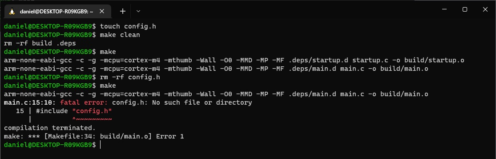

Observe que o **make** recompila o **target**. O erro apresentado agora é um
erro do compilador. Uma vez que o arquivo **config.h** não é necessário para
nosso programa podemos excluir a diretiva **#include "config.h"** e recompilar
o programa.

```
foo@bar$ make
```

Segue o arquivo **Makefile**

Arquivo: **Makefile**
```mak
# Ferramentas do toolchain

CC = arm-none-eabi-gcc
RM = rm -rf

# Diretorios arquivos objeto e de lista de dependencias serao salvos

OBJDIR = build
DEPDIR = .deps

# Arquivos a serem compilados

SRCS = startup.c \
        main.c

#Flags do compilador e linker

CFLAGS = -g -mcpu=cortex-m4 -mthumb -Wall -O0
DEPFLAGS = -MMD -MP -MF $(DEPDIR)/$*.d

# Gera lista de arquivos objeto e cria diretorio onde serao salvos

OBJS = $(patsubst %, $(OBJDIR)/%.o, $(basename $(SRCS)))
$(shell mkdir -p $(dir $(OBJS)) > /dev/null)

# Gera lista de arquivos de lista dependencia e cria diretorio onde serao salvos

DEPS = $(patsubst %, $(DEPDIR)/%.d, $(basename $(SRCS)))
$(shell mkdir -p $(dir $(DEPS)) > /dev/null)

all: $(OBJS)

$(OBJDIR)/%.o: %.c $(DEPDIR)/%.d
	$(CC) -c $(CFLAGS) $(DEPFLAGS) $< -o $@

# Cria um novo target para cada arquivo de dependencia possivel

$(DEPS):

# Inclui conteudo dos arquivos de dependencia

-include $(DEPS)

.PHONY: clean
clean:
	$(RM) $(OBJDIR) $(DEPDIR)
```
